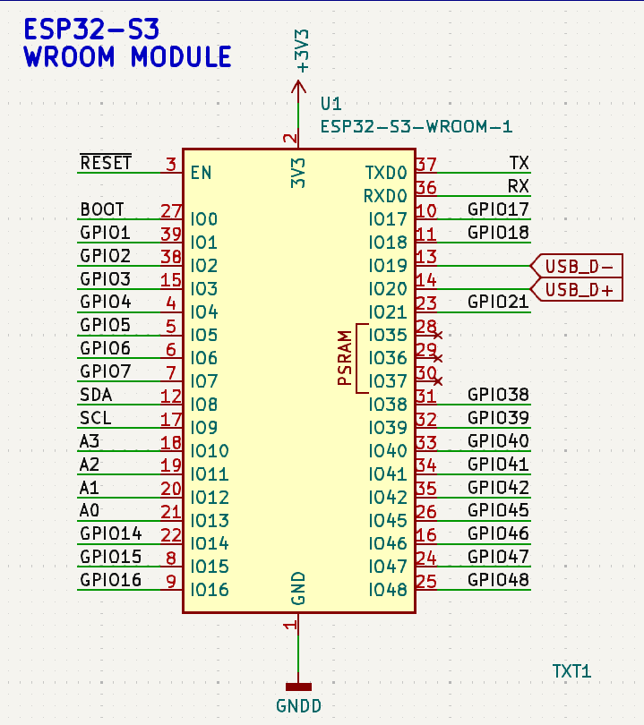

# ESP32-S3 Arduino Uno

_ESP32-S3 Module embeded on Arduino Uno board_


## I2C Pins

The provided schematic excerpt below shows the wiring of SDA and SCL; SDA is wired to the GPIO 8 and SCL is wired to the GPIO 9 on the ESP32-S3 Module.




### Micropython LED Blinky Code
``` python
import esp, esp32, time, os, _thread
from machine import Pin, SoftI2C

# An infinite loop thread to blink LED
def status_led():
    # Blink pattern blink-blink-pause
    while True:
        led.value(1)
        time.sleep_ms(250)
        led.value(0)
        time.sleep_ms(250)
        led.value(1)
        time.sleep_ms(250)
        led.value(0)
        time.sleep_ms(750)

# Display information about ESP32S3 module
print(os.uname())
print("Flash size: ", esp.flash_size()/1024/1024, "Mb")
#rint("MCU Temperature: ", esp32.mcu_temperature(), "C")
print("MCU Temperature: {:4.1f} C".format(esp32.mcu_temperature()))

# Configure LED pin and start the blinky loop thread
led = Pin(45, Pin.OUT)
led.value(0)
_thread.start_new_thread(status_led, ())
```


