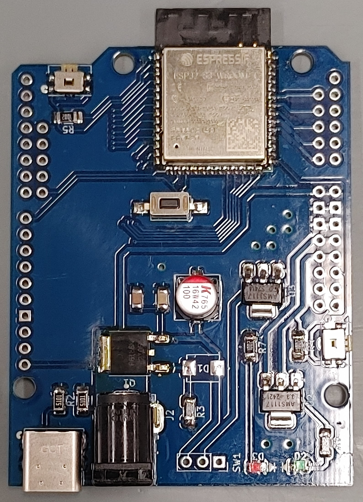

{{ page.title }}
================

<i>Explore new possibilities with ESP32-S3 UNO Development Board.</i>

<a href="{}">Schematic</a>

<ul>
  
    <li>
      <a href="{{ post.url }}">{{ post.title }}</a>
    </li>
  
</ul>
