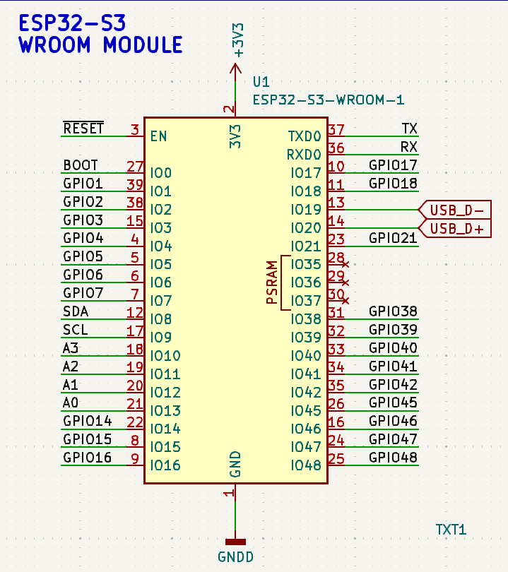

{{ page.title }}
================

<i>Discover new opportunities with the ESP32-S3 UNO Development Board.</i>
<p>Unlock a world of innovative possibilities with the ESP32-S3 UNO Development Board. This versatile platform empowers developers to create cutting-edge applications, leveraging its advanced features and robust performance. Whether you're working on IoT projects, embedded systems, or automation tasks, the ESP32-S3 UNO Development Board offers the flexibility, power and quick implementation needed to bring your ideas to life.</p>
<p>Explore its capabilities and push the boundaries of your creativity and technical expertise.</p>


[Schematic](schematic.md)

[Specs](specs.md)

## Compatibility with MicroPython

Integrating the ESP32-S3 UNO Development Board with MicroPython offers several compelling benefits:

1. Ease of Use
MicroPython simplifies the development process by allowing developers to write code in Python, a high-level, easy-to-read programming language. This reduces the learning curve for beginners and accelerates development for experienced programmers.

2. Rapid Prototyping
With MicroPython, developers can quickly prototype and test their ideas. The interactive REPL (Read-Eval-Print Loop) enables immediate feedback and debugging, making it easier to iterate and refine projects.

3. Extensive Libraries
MicroPython comes with a rich set of libraries that support various functionalities, including networking, sensor interfacing, and data processing. This extensive library support allows developers to leverage pre-built modules and focus on the unique aspects of their projects.

4. Cross-Platform Compatibility
MicroPython code can be easily ported across different hardware platforms that support MicroPython. This cross-platform compatibility ensures that projects developed on the ESP32-S3 UNO can be adapted to other MicroPython-compatible boards with minimal changes.

5. Community Support
The MicroPython community is active and growing, providing a wealth of resources, tutorials, and forums for troubleshooting and collaboration. This community support can be invaluable for both novice and experienced developers.

6. Efficient Resource Management
MicroPython is designed to run efficiently on microcontrollers, making it well-suited for resource-constrained environments. It allows developers to manage memory and processing power effectively, ensuring optimal performance of their applications.

7. Enhanced Connectivity
The ESP32-S3 UNO Development Board offers robust connectivity options, including Wi-Fi and Bluetooth. MicroPython's networking libraries make it straightforward to implement IoT applications, enabling seamless communication between devices.

8. Versatility
Combining the ESP32-S3 UNO with MicroPython opens up a wide range of applications, from simple sensor monitoring to complex automation systems. The versatility of this fusion allows developers to explore diverse project ideas and innovate freely.

9. Educational Value
MicroPython's simplicity and the ESP32-S3 UNO's capabilities make this combination an excellent educational tool. It provides a practical platform for learning programming, electronics, and IoT concepts, fostering a deeper understanding of technology.

10. Cost-Effective Development
Both the ESP32-S3 UNO Development Board and MicroPython are cost-effective solutions, making them accessible to hobbyists, educators, and professionals alike. This affordability encourages experimentation and innovation without significant financial investment.


## Features and Specifications of the ESP32-S3 WROOM Module
__Core Components:__
Microprocessor: Xtensa® dual-core 32-bit LX7 microprocessor, operating up to 240 MHz.
Memory:
384 KB ROM
512 KB SRAM
16 KB SRAM in RTC
Up to 16 MB PSRAM

__Connectivity:__
Wi-Fi:
Standards: 802.11b/g/n
Bit rate: Up to 150 Mbps (802.11n)
Frequency range: 2412 ~ 2484 MHz
Features: A-MPDU and A-MSDU aggregation, 0.4 μs guard interval support
Bluetooth:
Standards: Bluetooth 5, Bluetooth mesh
Speed: 125 Kbps, 500 Kbps, 1 Mbps, 2 Mbps
Features: Advertising extensions, multiple advertisement sets, channel selection algorithm #2
Co-existence mechanism: Internal co-existence mechanism between Wi-Fi and Bluetooth to share the same antenna

__Peripherals:__
GPIOs: Up to 36 GPIOs, including 4 strapping GPIOs
Interfaces:
SPI
LCD interface
Camera interface
UART
I2C
I2S
Remote control
Pulse counter
LED PWM
Full-speed USB 2.0 OTG
USB Serial/JTAG controller
MCPWM
SDIO host controller
GDMA
TWAI® controller (compatible with ISO 11898-1)
ADC
Touch sensor
Temperature sensor
Timers and watchdogs

__Integrated Components:__
Crystal Oscillator: 40 MHz
Flash: Up to 16 MB Quad SPI flash
Antenna Options
ESP32-S3-WROOM-1: On-board PCB antenna
ESP32-S3-WROOM-1U: External antenna via a connector
Operating Conditions
Operating Voltage: 3.0 ~ 3.6 V
Ambient Temperature:
Standard version: –40 ~ 65 °C
Extended version: –40 ~ 85 °C
High-temperature version: –40 ~ 105 °C

__Certifications:__
RF Certification: Various certifications available
Green Certification: RoHS/REACH compliant

__Applications:__
Ideal for AI and Artificial Intelligence of Things (AIoT) applications such as:
Wake word detection
Speech commands recognition
Face detection and recognition
Smart home devices
Smart appliances
Smart control panels
Smart speakers

## I2C Pins

The schematic excerpt provided below illustrates the wiring configuration for the __SDA__ and __SCL__ lines. Specifically, the __SDA__ line is connected to _GPIO 8_, while the __SCL__ line is connected to _GPIO 9_ on the ESP32-S3 module.



The image of the PCB board below depicts the physical locations of the __SDA__ and __SCL__ terminals.


### Micropython LED Blinky Code

``` python
import esp, esp32, time, os, _thread
from machine import Pin, SoftI2C

# An infinite loop thread to blink LED
def status_led():
    # Blink pattern blink-blink-pause
    while True:
        led.value(1)
        time.sleep_ms(250)
        led.value(0)
        time.sleep_ms(250)
        led.value(1)
        time.sleep_ms(250)
        led.value(0)
        time.sleep_ms(750)

# Display information about ESP32S3 module
print(os.uname())
print("Flash size: ", esp.flash_size()/1024/1024, "Mb")
#rint("MCU Temperature: ", esp32.mcu_temperature(), "C")
print("MCU Temperature: {:4.1f} C".format(esp32.mcu_temperature()))

# Configure LED pin and start the blinky loop thread
led = Pin(45, Pin.OUT)
led.value(0)
_thread.start_new_thread(status_led, ())
```
