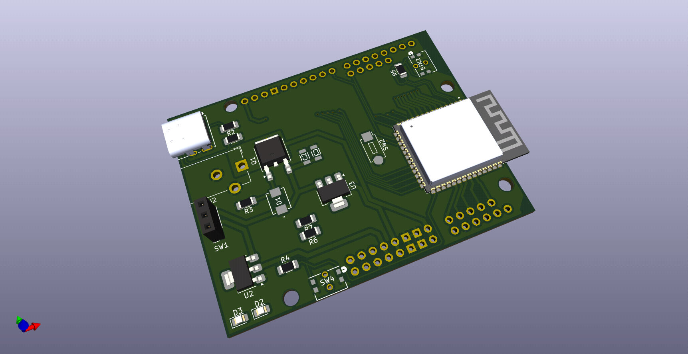

.. ESP32-S3 Arduino Uno documentation master file, created by
   sphinx-quickstart on Tue Oct 15 00:57:00 2024.
   You can adapt this file completely to your liking, but it should at least
   contain the root `toctree` directive.

ESP32-S3 Arduino Uno Project
==================================

*This guide will walk you through the steps required to design an ESP32-S3 development board.
The schematic design for this development board is based on the technical guidelines
for ESP32-S3 WROOM module.

ESP32-S3 WROOM is a widely used microcontroller module. It is compact and packs significant
computing power and capabilities.*

Add your content using ``reStructuredText`` syntax. See the
`reStructuredText <https://www.sphinx-doc.org/en/master/usage/restructuredtext/index.html>`_
documentation for details.

.. toctree::
   :maxdepth: 2
   :caption: Contents:

   0_overview
